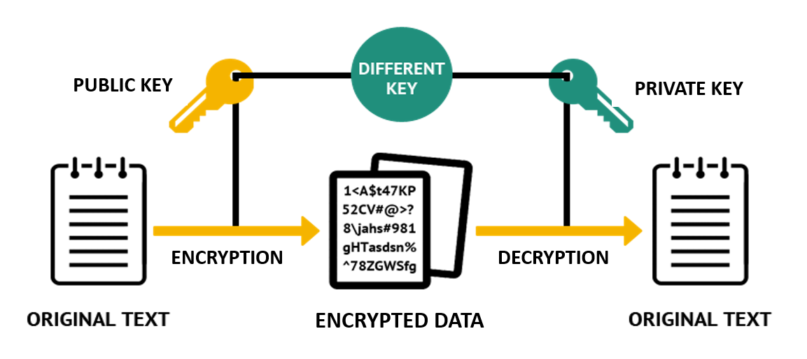

# Chat application with Key-Distribution-Center (KDC) Implementation

This project is a real time chat application built with ExpressJS framework that allows users to create rooms and chat with each other securely. The project consists of a secure server, the Key Distribution Center (KDC), enabling users to exchange a Caesar Key (sessionKey) safely using RSA encryption. 

## Table of Contents 
* [Key Distribution Center](#key-distribution-center)
* [RSA (Rivest–Shamir–Adleman) algorithm](#rsa-rivestshamiradleman-algorithm)
* [Caesar Cipher](#caesar-cipher)
* [Features of the Project](#features-of-the-project)
* [Installation of the project](#installation-of-the-project)
* [Usage of the application](#usage-of-the-application)
* [Contributing](#contributing)


## Key Distribution Center


In cryptography, a Key Distribution Center (KDC) provides keys to users in a network sharing sensitive data. It is used in many network authentication protocols, particularly in the context of Kerberos, a widely used authentication protocol in computer networks.
### How KDC works? 
* Users register with the KDC by providing their identity information and generating a public/private key pair. The public key is shared with the KDC, while the private key remains secret.
* When the users wish to join a server, they request a session key from the KDC. The KDC generates a unique session key by randomly generating a number.
* The KDC securely sends the session key to both users. It encrypts the key using each user's public key before sending it to them.
* Upon receiving the encrypted session key, the users decrypt it using their private keys, thus obtaining the shared session key.
This process for encrypting and decrypting the session key is called the RSA algorithm.
* With the session key securely exchanged between them, the users can communicate securely using symmetric encryption techniques. The session key is used to encrypt and decrypt the messages exchanged during the communication session.
* The session key is usually valid for a short time or for just one session. Once the session ends, the key is either discarded or marked as expired to maintain security.

## RSA (Rivest–Shamir–Adleman) algorithm


The RSA encryption algorithm is widely used for securing data. It employs a pair of keys, public and private, which are mathematically linked. Data encrypted with public key can only be decrypted with the private key. This flexibility enables secure communication over networks. The sender encrypts data with the recipient's public key, ensuring only the recipient, with the corresponding private key, can decrypt it, even if intercepted during transit.

## Caesar Cipher 


Caesar Cipher is one of the simplest and most widely known encryption techniques. It's a substitution cipher where each letter in the plaintext is shifted a certain number of places down or up the alphabet. For example, with a shift of 3, 'A' would be replaced by 'D', 'B' would become 'E', and so on. The method is named after Julius Caesar, who allegedly used it to communicate with his generals.

It's a monoalphabetic substitution cipher, meaning that each letter is replaced with another letter, preserving the letter frequency distribution of the plaintext. However, it's highly vulnerable to brute-force attacks, where every possible shift is tested until the correct one is found. Despite its simplicity, Caesar Cipher is still used as a part of more complex encryption algorithms or in educational contexts to illustrate basic cryptographic principles.

## Features of the Project 
This project's main features are as follows: 
* Key Distribution Center implementation that provides secure key distribution using RSA encryption.
* Session based authentication that provides users to login and register securely. 
* Socket.io implementation that provides users a secure WebSocket server to chat with each other
* Using of JSON files as database for saving datas.

## Installation of the project
To install and run the project, you should go through the following steps: 
### Step 1: Clone the repository
At first you need to clone this repository by typing the following commands in your terminal :
```sh 
git clone https://github.com/Javid-Sadigli/Chat-App-With-KDC-Implementation.git 
cd Chat-App-With-KDC-Implementation
```

### Step 2: Install the dependencies 
After cloning the project, you need to install its dependencies by typing the following command in your terminal : 
```sh 
npm install
```

### Step 3 : Run the project
After installing the dependencies and setting up the variables you can run the project using the following command : 

```sh 
npm start
```

## Usage of the application
1. Register with your username and password. 
2. Login with your username and password. 
3. Create a new room for chatting or join a room with its password. 
4. If you have created a room, give the room password to the persons 
   you want to chat. 

## Contributing
Contributions are welcome! Follow these steps to contribute:
* Fork the project.
* Create a new branch: `git checkout -b feature/your-feature`. 
* Add your new features.
* Submit a pull request. 

<br>

# Thanks for your attention! 
